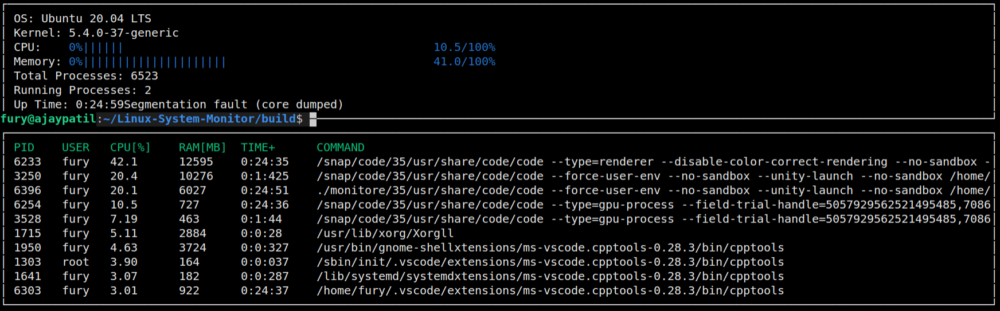

# System-Monitor

For the final project in the Object Oriented Programming Course of the [Udacity C++ Nanodegree Program](https://www.udacity.com/course/c-plus-plus-nanodegree--nd213), I built a Linux System Monitor quite similar to the htop application.  

The source code provided was an empty ncursus display window. I extracted relevant data needed to compute memory and cpu usage and sorted processes based on those. Furthermore, all the fields in the system monitor were parsed, including uptime, pids, usernames, system name, kernal, total and running processes etc. OOP concepts of composition of classes and multi-level inheritance were used. 

## ncurses
[ncurses](https://www.gnu.org/software/ncurses/) is a library that facilitates text-based graphical output in the terminal. This project relies on ncurses for display output.

Install ncurses within your own Linux environment with the following command: `sudo apt install libncurses5-dev libncursesw5-dev`

## Make
This project uses [Make](https://www.gnu.org/software/make/). The Makefile has four targets:
* `build` compiles the source code and generates an executable
* `format` applies [ClangFormat](https://clang.llvm.org/docs/ClangFormat.html) to style the source code
* `debug` compiles the source code and generates an executable, including debugging symbols
* `clean` deletes the `build/` directory, including all of the build artifacts

## Instructions

1. Clone the project repository: `git clone https://github.com/udacity/CppND-System-Monitor-Project-Updated.git`

2. Build the project: `make build`

3. Run the resulting executable: `./build/monitor`